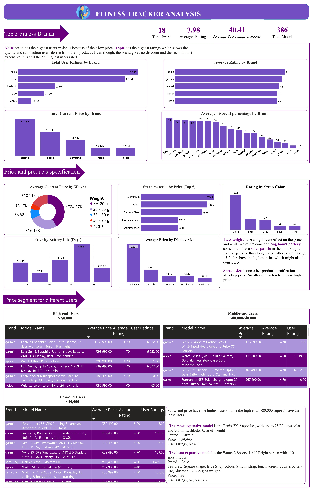

# India-Fitness-Tracker
An overview of fitness tracker in the Indian market
The dataset contains record of fitness tracker in Indian market. It consist of different products from various brands with their specifications, ratings and reviews. The dataset was collected from flipkart and amazon using web scraping techniqu and made available by astrato. 
# Objectives
- Is there a significant demand for fitness trackers in the Indian market
- Information on top 5 brands
- Corellations between the prices and product specification and ratings
- Different types of fitness trackers,their price segments for different users
 Tool Used; Power BI
## Steps taken to achieving the insight
 - Used find and replace to change the blank cells to 0
 - Used Conditional formatting to create extra column.
 - Visualize and story telling
 
 ## Insight generated
 - Noise brand has the highest users which is because of their low price. Apple has the highest ratings which shows the quality and satisfaction users derive from their products. Even though, the brand gives no discount and the second most expensive, it is still the 5th highest users rated
 - Less weight have a significant effect on the price and while we might consider long hours battery, some brand have solar panels in them making it more expensive than long hours battery even though 15-20 hrs have the highest price which might also be considered.
 - Screen size is one other product specification affecting price. Smaller screen tends to have higher  price.
 - Low end price have the highest users whlie the high end (>80,000 rupees) have the least users.  
 - The most expensive model is the Fenix 7X Sapphire, with up to 28/37 days solar and buit in flashlight, 0.1g of weight, Brand- Garmin, Price - 139,990, User ratings; 6k 4.7.
 - The least expensive model is the Watch 2 Sports, 1.69" Bright screen with 110+ sport modes, Brand - Dizo
Features;  Square shape, Blue Strap colour, Silicon strap, touch screen, 22days battery life, bluetooth, 20-35 g of weight.
Price; 1,990, User ratings; 62,924 ; 4.2 

